<h3><code>gokul@github ~ $ ./contributions.sh</code></h3>

  

<h3><code>gokul@github ~ $ whoami</code></h3>
<table>
  <tr>
    <td valign="top"></td>
    <td valign="top"></td>
  </tr>
</table>

 

<h3><code>gokul@github ~ $ cat links.txt</code></h3>
<code><a href="https://portfolio-omega-orpin-11.vercel.app">portfolio</a></code> ·
<code><a href="https://www.linkedin.com/in/gokul-shiva-7b33b5296/">linkedin</a></code> ·
<code><a href="mailto:gokulshiva085@gmail.com">email</a></code> ·
<code><a href="https://www.johannahealthcare.in/">johannahealthcare.in</a></code> ·
<code><a href="https://houseofstaffoffshoretalent.com/">houseofstaffoffshoretalent.com</a></code>

  

Need a website for your business? <a href="mailto:gokulshiva085@gmail.com?subject=Website%20project%20enquiry">Get in touch</a>.

